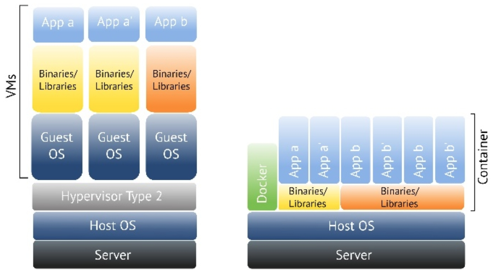

# Docker Intro

----

###  Was ist Docker?

- Open Source Projekt
- Engine zum Standardisieren von Prozessumgebungen unter Linux
- *"build, ship and run (distribruted) applications"*
- Für Developer und SysAdmins
- Verwendung bestehender Container-Technologien (LXC / libcontainer / ...)
- Einfaches Erstellen und Teilen von Container *Images*
- **Kein** virtueller Server! (weniger Overhead)

----
###  Eigenschaften

- Ermöglicht automatisches Deployment einer standardisierten Prozessumgebung für Linux-Anwendungen
- Alles was unter Linux läuft, funktioniert auch unter Docker
- Docker läuft auf 
  - allen gängigen Linux Distibutionen
  - "neueren" Windows Servern
- Alle benötigten Funktionen befinden sich innerhalb des Containers:
  - Bibliotheken
  - Dependencies
  - Binärdateien
- Container sind auf die Architektur der Host-Plattform beschränkt!

----
### Vorteile

- klein
- schnell
- "sicher"
- flexibel
- reproduzierbar
- portabel

----
### Unterschied VM vs. Container



**VM:** komplette "Maschine" inkl. Kernel mit Hilfe eines Hypervisors virtualisiert.

**Container:** nur Prozesse virtualisiert, das OS und Binaries/Libraries werden gemeinsam genutzt.

----
### Images, Container und Registries

- **Docker Images**
  - read only template
  - Basis für Container
- **Docker Container**
  - wird auf Basis eines Images und Dockerfiles erzeugt
  - hält zur Laufzeit die Änderungen vor (Read/Write Layer)
  - Änderungen können in ein neues Image übernommen werden ("commit")
- **Docker Regisitries**
  - Image Repository
  - privat oder öffentlich
  - z.B. *Docker Hub*

----
### Die Docker-Engine

  

**Server:** Daemon für Serverprozess zur Verwaltung der Container

**Client**: zur (Fern-)Steuerung des Daemons

----
### Storage, Images und Container


- Alles basiert auf Layers
- bis auf den obersten Layer alle read-only
- beinhalten Änderungen bzw. Diffs
- Man hat Base-Images auf die ein Container "aufsetzt"

----
### Dockerfiles - Grundlagen

- Bauanleitung für ein Image
- Anweisungen für die Erstellung eines IMages
- Einzeilig, beginnen mit Schlüsselwort
- Anweisungen sind *nicht* case-sensitiv (Schlüsselwörter üblicherweise groß)
- Kommentare mit #-Zeichen eingeleitet

----
### Dockerfiles  - Beispiel

Beispiel Dockerfile für MySQL-Server:

```bash
FROM rhel 
MAINTAINER Max Mustermann <max@mustermann.at>
RUN yum install -y mysql mysql-server 
ADD start.sh /start 
RUN chmod +x /start 
EXPOSE 3306 
CMD ["/start"] 
```

----
> Beginne mit dem Einfachen. Suche immer die “Low hanging fruit” – beispielsweise indem du erst einmal einen Webserver für dich zum Laufen bringst. Dann nimm deinen Host und richte darauf einen Orchestrator ein, um deine Anwendung resilient zu machen. Wenn das funktioniert, kannst du dir eine Anwendung vornehmen, die persistente Daten verwendet. So kommst du Schritt für Schritt weiter und kannst allmählich alle deine Anwendungen von virtuellen Maschinen auf Container übertragen.
> (<https://jaxenter.de/12-docker-tipps-61328>)

----
### Next Steps
- Gute Einführung (English): <http://theodorosploumis.github.io/docker-presentation/#/>
- bzw. <https://hub.docker.com/r/tplcom/docker-presentation>
- RancherOS: <https://rancher.com/docs/os/v1.x/en/>
- Official Docker Tutorial: <https://docs.docker.com/get-started/>
- 11 Punkte Tutorial : <https://entwickler.de/online/development/docker-einsteiger-tutorial-210720.html>
- jaxcenter Tutorial: <https://jaxenter.de/einfuehrung-docker-tutorial-container-61528>